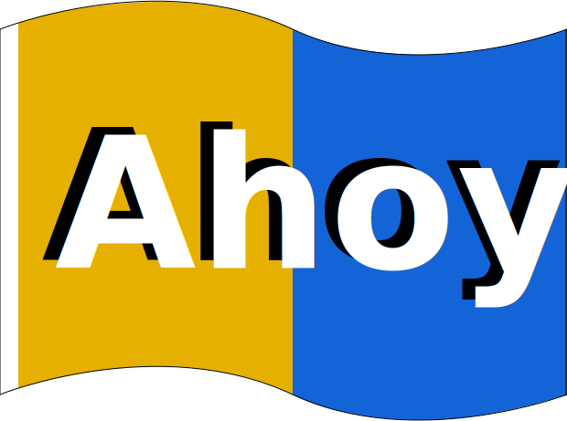

<div align="center">

<picture>
  <source srcset="img/rect/ahoy-logo-rect-v2.webp" type="image/webp">
  
</picture>

<h1>Ahoy!</h1>

<h3>Automate and organise your workflows, no matter what technology you use.</h3>

[](https://github.com/ahoy-cli/ahoy/actions/workflows/build_and_test.yml) [](https://goreportcard.com/report/github.com/ahoy-cli/ahoy)
<!-- ALL-CONTRIBUTORS-BADGE:START - Do not remove or modify this section -->
[](#contributors-)
<!-- ALL-CONTRIBUTORS-BADGE:END -->

</div>

Ahoy is a command line tool that gives each of your projects its own CLI app with zero code and dependencies.

Write your commands in a YAML file and then Ahoy gives you lots of features like:
- a command listing
- per-command help text
- command tab completion
- run commands from any subdirectory

Ahoy makes it easy to create aliases and templates for commands that are useful. It was created to help with running interactive commands within Docker containers, but it's just as useful for local commands, commands over `ssh`, or really anything that could be run from the command line in a single clean interface.

## Examples

Say you want to import a MySQL database running in `docker-compose` using another container called `cli`. The command could look like this:

`docker exec -i $(docker-compose ps -q cli) bash -c 'mysql -u$DB_ENV_MYSQL_USER -p$DB_ENV_MYSQL_PASSWORD -h$DB_PORT_3306_TCP_ADDR $DB_ENV_MYSQL_DATABASE' < some-database.sql`

With Ahoy, you can turn this into:

`ahoy mysql-import < some-database.sql`

## Quick Start

Get started immediately with our comprehensive examples file:

```bash
# Create a new project with example commands
ahoy init

# Or download the examples file directly
curl -o .ahoy.yml https://raw.githubusercontent.com/ahoy-cli/ahoy/master/examples/examples.ahoy.yml
```

The examples file includes **30+ usable example commands** for:
- **Local Development Environments** - `up`, `down`, `restart`, `status`
- **Testing & Quality** - `test`, `lint` with multi-language support
- **Database Operations** - `db`, `db:backup` for MySQL/PostgreSQL
- **Build & Deployment** - `build`, `deploy` with safety checks
- **Drupal Integration** - `drush`, `cr`, `uli`, `cex`, `cim` for Drupal projects

**🔍 [View the complete examples file →](examples/examples.ahoy.yml)**

Try it out:
```bash
ahoy status    # Show service status
ahoy urls      # Show available URLs
ahoy shell     # Open a shell in your container
```

## Features

- Non-invasive - Use your existing workflow! It can wrap commands and scripts you are already using.
- Consistent - Commands always run relative to the `.ahoy.yml` file, but can be called from any subfolder.
- Visual - See a list of all your commands in one place, along with helpful descriptions.
- Flexible - Commands are specific to a single folder tree, so each repo/workspace can have its own commands.
- Command templates - Use regular `bash` syntax like `"$@"` for all arguments, or `$1` for the first argument.
- Fully interactive - Your shells (like MySQL) and prompts still work.
- Import multiple config files using the "imports" field.
- Uses the "last in wins" rule to deal with duplicate commands amongst the config files.
- [Command aliases](#command-aliases) - oft-used or long commands can have aliases.
- Use a different entrypoint (the thing that runs your commands) if you wish, instead of `bash`. E.g. using PHP, Node.js, Python, etc. is possible.
- Plugins are possible by overriding the entrypoint.
- Self-documenting - Commands and help declared in `.ahoy.yml` show up as ahoy command help and [shell completion](#shell-autocompletions) of commands (see [bash/zsh completion](https://ahoy-cli.readthedocs.io/en/latest/#bash-zsh-completion)) is also available. We now have a dedicated Zsh plugin for completions at [ahoy-cli/zsh-ahoy](https://github.com/ahoy-cli/zsh-ahoy).
- Support for [environment variables](#environment-variables) at both file and command level using the `env` field
- Environment variables from a global file are loaded first, then command-specific variables override them
- Environment files use standard shell format with one variable per line, comments supported

## Installation

### macOS

Using Homebrew / Linuxbrew:

```
brew install ahoy
```

### Linux

Download the [latest release from GitHub](https://github.com/ahoy-cli/ahoy/releases), move the appropriate binary for your plaform into someplace in your $PATH and rename it `ahoy`.

Example:
```
os=$(uname -s | tr '[:upper:]' '[:lower:]') && architecture=$(case $(uname -m) in x86_64 | amd64) echo "amd64" ;; aarch64 | arm64 | armv8) echo "arm64" ;; *) echo "amd64" ;; esac) && sudo wget -q https://github.com/ahoy-cli/ahoy/releases/latest/download/ahoy-bin-$os-$architecture -O /usr/local/bin/ahoy && sudo chown $USER /usr/local/bin/ahoy && chmod +x /usr/local/bin/ahoy
```

### Windows

For WSL2, use the Linux binary above for your architecture.

## Environment Variables

Ahoy supports loading environment variables from files at both global and command levels, with support for multiple environment files.

#### Single Environment File (backwards compatible):

```yaml
ahoyapi: v2

# Global environment file relative to .ahoy.yml
env: .env

commands:
  db-import:
    # Command-specific environment file, overrides global vars
    env: .env.db
    usage: Import a database
    cmd: mysql -u$DB_USER -p$DB_PASSWORD $DB_NAME < $1
```

#### Multiple Environment Files (new feature):

```yaml
ahoyapi: v2

# Multiple global environment files loaded in order
env:
  - .env.base
  - .env.local
  - .env.override

commands:
  deploy:
    # Multiple command-specific env files
    env:
      - .env.deploy
      - .env.secrets
    usage: Deploy the application
    cmd: ./deploy.sh
```

#### Environment File Format:
```sh
# Global .env file
DB_USER=root
DB_PASSWORD=root

# Command-specific .env.db file
DB_USER=custom_user
DB_PASSWORD=secret
DB_NAME=mydb
```

**Key Features:**
- Files are loaded in order, with later files overriding earlier ones
- Command-level env files override global env files
- Non-existent files are gracefully ignored
- Supports comments and empty lines in env files
- Maintains full backwards compatibility with single file syntax

## Command Aliases

Ahoy now supports command aliases. This feature allows you to define alternative names for your commands, making them more convenient to use and remember.

### Usage

In your `.ahoy.yml` file, you can add an `aliases` field to any command definition. The `aliases` field should be an array of strings, each representing one or more alternative names for the command.

Example:

```yaml
ahoyapi: v2
commands:
  hello:
    usage: Say hello
    cmd: echo "Hello, World!"
    aliases: ["hi", "greet"]
```

In this example, the `hello` command can also be invoked using `hi` or `greet`.

### Benefits

- Improved usability: Users can call commands using shorter or more intuitive names.
- Flexibility: You can provide multiple ways to access the same functionality without duplicating command definitions.
- Backward compatibility: You can introduce new, more descriptive command names while keeping old names as aliases.

### Notes

- Aliases are displayed in the help output for each command.
- Bash completion works with aliases as well as primary command names.
- **If multiple commands share the same alias, the "last in wins" rule is used and the last matching command will be executed.**

## Shell autocompletions

### Zsh

For Zsh completions, we have a standalone plugin available at [ahoy-cli/zsh-ahoy](https://github.com/ahoy-cli/zsh-ahoy).

### Bash

For Bash, you'll need to make sure you have bash-completion installed and setup. See [bash/zsh completion](https://ahoy-cli.readthedocs.io/en/latest/#bash-zsh-completion) for further instructions.

## Example of the YAML file setup

```YAML
# All files must have v2 set or you'll get an error
ahoyapi: v2

# You can now override the entrypoint. This is the default if you don't override it.
# {{cmd}} is replaced with your command and {{name}} is the name of the command that was run (available as $0)
entrypoint:
  - bash
  - "-c"
  - '{{cmd}}'
  - '{{name}}'
commands:
  simple-command:
      usage: An example of a single-line command.
      cmd: echo "Do stuff with bash"

  complex-command:
      usage: Show more advanced features.
      cmd: | # We support multi-line commands with pipes.
          echo "multi-line bash script";
          # You can call other ahoy commands.
          ahoy simple-command
          # you can take params
          echo "your params were: $@"
          # you can use numbered params, same as bash.
          echo "param1: $1"
          echo "param2: $2"
          # Everything bash supports is available, if statements, etc.
          # Hate bash? Use something else like python in a subscript or change the entrypoint.

  subcommands:
      usage: List the commands from the imported config files.
      # These commands will be aggregated together with later files overriding earlier ones if they exist.
      imports:
        - ./some-file1.ahoy.yml
        - ./some-file2.ahoy.yml
        - ./some-file3.ahoy.yml
```

## Planned Features

- Enable specifying specific arguments and flags in the ahoy file itself to cut down on parsing arguments in scripts.
- Support for more built-in commands or a "verify" YAML option that would create a yes / no prompt for potentially destructive commands. (Are you sure you want to delete all your containers?)
- Pipe tab completion to another command (allows you to get tab completion).
- Support for configuration.

## Sponsors 💰 👏

- [<br />Alex Skrypnyk - DrevOps](https://drevops.com)

## Contributors ✨

Thanks to all these wonderful people ([emoji key](https://allcontributors.org/docs/en/emoji-key)):

<!-- ALL-CONTRIBUTORS-LIST:START - Do not remove or modify this section -->
<!-- prettier-ignore-start -->
<!-- markdownlint-disable -->
<table>
  <tbody>
    <tr>
      <td align="center" valign="top" width="14.28%"><a href="https://github.com/acouch"><br /><sub><b>Aaron Couch</b></sub></a><br /><a href="https://github.com/ahoy-cli/Ahoy/commits?author=acouch" title="Documentation">📖</a></td>
      <td align="center" valign="top" width="14.28%"><a href="https://github.com/aashil"><br /><sub><b>Aashil Patel</b></sub></a><br /><a href="https://github.com/ahoy-cli/Ahoy/commits?author=aashil" title="Code">💻</a> <a href="https://github.com/ahoy-cli/Ahoy/commits?author=aashil" title="Documentation">📖</a></td>
      <td align="center" valign="top" width="14.28%"><a href="https://www.drevops.com/"><br /><sub><b>Alex Skrypnyk</b></sub></a><br /><a href="https://github.com/ahoy-cli/Ahoy/issues?q=author%3AAlexSkrypnyk" title="Bug reports">🐛</a> <a href="https://github.com/ahoy-cli/Ahoy/pulls?q=is%3Apr+reviewed-by%3AAlexSkrypnyk" title="Reviewed Pull Requests">👀</a> <a href="#question-AlexSkrypnyk" title="Answering Questions">💬</a> <a href="#promotion-AlexSkrypnyk" title="Promotion">📣</a> <a href="#ideas-AlexSkrypnyk" title="Ideas, Planning, & Feedback">🤔</a> <a href="#financial-AlexSkrypnyk" title="Financial">💵</a> <a href="#security-AlexSkrypnyk" title="Security">🛡️</a></td>
      <td align="center" valign="top" width="14.28%"><a href="http://www.linkedin.com/in/alexandrerafalovitch"><br /><sub><b>Alexandre Rafalovitch</b></sub></a><br /><a href="https://github.com/ahoy-cli/Ahoy/commits?author=arafalov" title="Documentation">📖</a></td>
      <td align="center" valign="top" width="14.28%"><a href="https://github.com/hanoii"><br /><sub><b>Ariel Barreiro</b></sub></a><br /><a href="https://github.com/ahoy-cli/Ahoy/commits?author=hanoii" title="Code">💻</a></td>
      <td align="center" valign="top" width="14.28%"><a href="https://agaric.coop/"><br /><sub><b>Benjamin Melançon</b></sub></a><br /><a href="https://github.com/ahoy-cli/Ahoy/commits?author=mlncn" title="Documentation">📖</a></td>
      <td align="center" valign="top" width="14.28%"><a href="https://github.com/ocean"><br /><sub><b>Drew Robinson</b></sub></a><br /><a href="https://github.com/ahoy-cli/Ahoy/commits?author=ocean" title="Code">💻</a> <a href="https://github.com/ahoy-cli/Ahoy/issues?q=author%3Aocean" title="Bug reports">🐛</a> <a href="#content-ocean" title="Content">🖋</a> <a href="https://github.com/ahoy-cli/Ahoy/commits?author=ocean" title="Documentation">📖</a> <a href="#ideas-ocean" title="Ideas, Planning, & Feedback">🤔</a> <a href="#infra-ocean" title="Infrastructure (Hosting, Build-Tools, etc)">🚇</a> <a href="#maintenance-ocean" title="Maintenance">🚧</a> <a href="#platform-ocean" title="Packaging/porting to new platform">📦</a> <a href="#question-ocean" title="Answering Questions">💬</a> <a href="https://github.com/ahoy-cli/Ahoy/pulls?q=is%3Apr+reviewed-by%3Aocean" title="Reviewed Pull Requests">👀</a> <a href="#security-ocean" title="Security">🛡️</a> <a href="https://github.com/ahoy-cli/Ahoy/commits?author=ocean" title="Tests">⚠️</a></td>
    </tr>
    <tr>
      <td align="center" valign="top" width="14.28%"><a href="https://www.elijahlynn.net/"><br /><sub><b>Elijah Lynn</b></sub></a><br /><a href="https://github.com/ahoy-cli/Ahoy/commits?author=ElijahLynn" title="Documentation">📖</a></td>
      <td align="center" valign="top" width="14.28%"><a href="https://botsandbrains.com/"><br /><sub><b>Frank Carey</b></sub></a><br /><a href="https://github.com/ahoy-cli/Ahoy/commits?author=frankcarey" title="Code">💻</a> <a href="https://github.com/ahoy-cli/Ahoy/issues?q=author%3Afrankcarey" title="Bug reports">🐛</a> <a href="#content-frankcarey" title="Content">🖋</a> <a href="https://github.com/ahoy-cli/Ahoy/commits?author=frankcarey" title="Documentation">📖</a> <a href="#ideas-frankcarey" title="Ideas, Planning, & Feedback">🤔</a> <a href="#infra-frankcarey" title="Infrastructure (Hosting, Build-Tools, etc)">🚇</a> <a href="#maintenance-frankcarey" title="Maintenance">🚧</a> <a href="#platform-frankcarey" title="Packaging/porting to new platform">📦</a> <a href="#question-frankcarey" title="Answering Questions">💬</a> <a href="https://github.com/ahoy-cli/Ahoy/pulls?q=is%3Apr+reviewed-by%3Afrankcarey" title="Reviewed Pull Requests">👀</a> <a href="#security-frankcarey" title="Security">🛡️</a> <a href="https://github.com/ahoy-cli/Ahoy/commits?author=frankcarey" title="Tests">⚠️</a></td>
      <td align="center" valign="top" width="14.28%"><a href="https://github.com/jackwrfuller"><br /><sub><b>Jack Fuller</b></sub></a><br /><a href="https://github.com/ahoy-cli/Ahoy/issues?q=author%3Ajackwrfuller" title="Bug reports">🐛</a> <a href="https://github.com/ahoy-cli/Ahoy/commits?author=jackwrfuller" title="Code">💻</a> <a href="https://github.com/ahoy-cli/Ahoy/commits?author=jackwrfuller" title="Documentation">📖</a> <a href="https://github.com/ahoy-cli/Ahoy/commits?author=jackwrfuller" title="Tests">⚠️</a></td>
      <td align="center" valign="top" width="14.28%"><a href="https://github.com/jnsalsa"><br /><sub><b>Jonathan Nagy</b></sub></a><br /><a href="https://github.com/ahoy-cli/Ahoy/issues?q=author%3Ajnsalsa" title="Bug reports">🐛</a> <a href="https://github.com/ahoy-cli/Ahoy/commits?author=jnsalsa" title="Code">💻</a></td>
      <td align="center" valign="top" width="14.28%"><a href="https://msound.net/"><br /><sub><b>Mani Soundararajan</b></sub></a><br /><a href="https://github.com/ahoy-cli/Ahoy/commits?author=msound" title="Documentation">📖</a></td>
      <td align="center" valign="top" width="14.28%"><a href="https://morpht.com/"><br /><sub><b>Marji Cermak</b></sub></a><br /><a href="https://github.com/ahoy-cli/Ahoy/commits?author=marji" title="Documentation">📖</a></td>
      <td align="center" valign="top" width="14.28%"><a href="https://github.com/dkinzer"><br /><sub><b>david kinzer (he/him)</b></sub></a><br /><a href="https://github.com/ahoy-cli/Ahoy/commits?author=dkinzer" title="Code">💻</a></td>
    </tr>
  </tbody>
</table>

<!-- markdownlint-restore -->
<!-- prettier-ignore-end -->

<!-- ALL-CONTRIBUTORS-LIST:END -->

This project follows the [all-contributors](https://github.com/all-contributors/all-contributors) specification. Contributions of any kind welcome!
